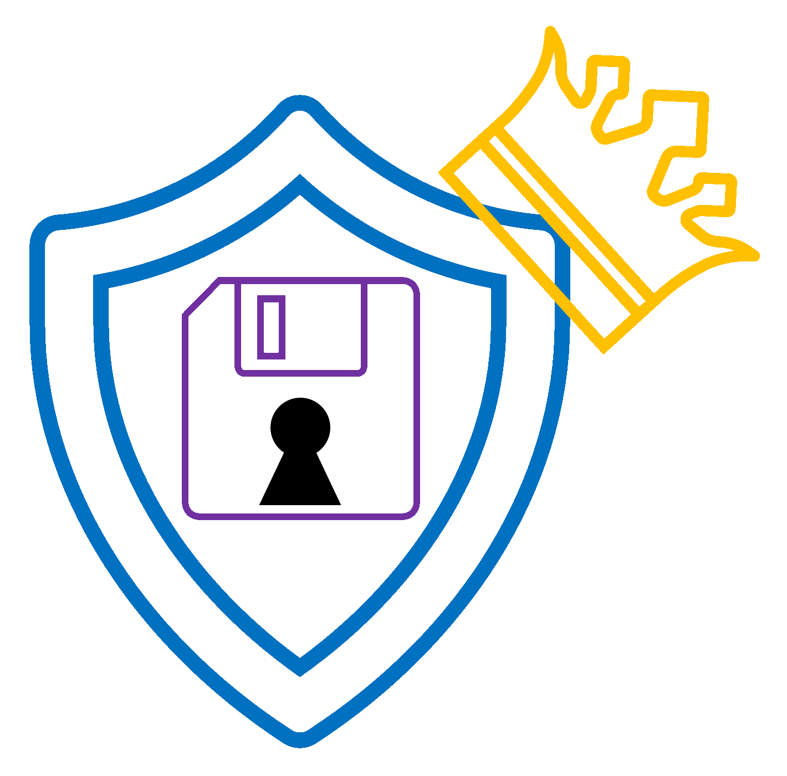
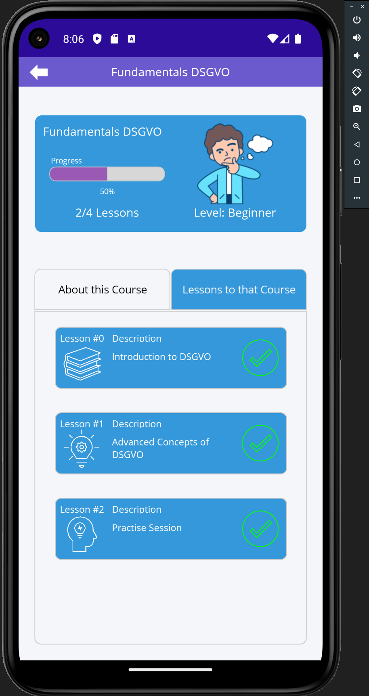
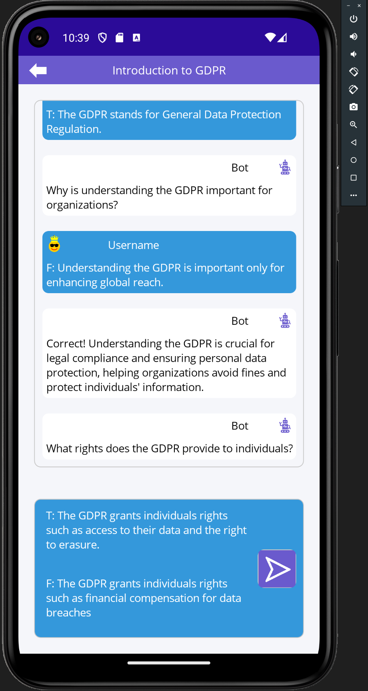
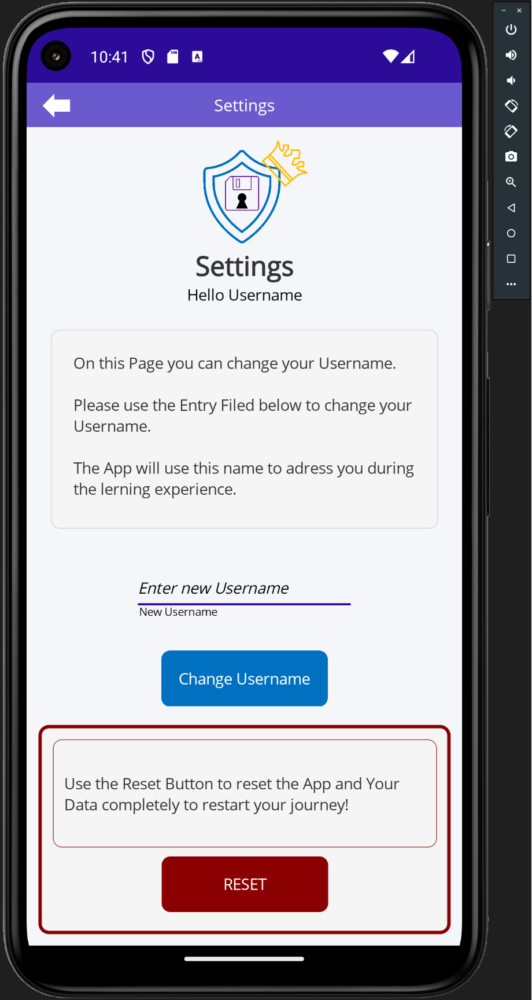

<!-- PROJECT LOGO -->
<br />
<div align="center">
  <a href="https://github.com/Lakusan/invisnav">
    
  </a>

<h3 align="center">
<span style="color: Greenyellow;">Da</span>
    <span style="color: Darkorange;">Pro</span>
    <span style="color: Purple;">Ta</span></h3>

  <p align="center">
    <br />
    <span style="color: Greenyellow;">Data</span>
    <span style="color: Darkorange;">Protection</span>
    <span style="color: Purple;">Training App</span>

</div>


<!-- ABOUT THE PROJECT -->
## About The Project
<div>
    </br>
    <p>
    This application was developed during the  Module Mobile App Development as part of my Master Degree in Applied Computer Science at SRH University Heidelberg, in December 2023.
    </p>
    <p>
        The Data Protection Training app (DaProTa) is an Android application designed to educate users on the fundamental aspects of data privacy in Germany. It focuses on the General Data Protection Regulation (GDPR), a comprehensive EU regulation aimed at protecting personal data and standardizing data protection laws across member states. The goal is to transform learning into an immersive journey, breaking down complex concepts into manageable parts, and leaving users not only informed but also enthusiastic about applying DSGVO principles in their daily lives.
    </p>
    <p>
      DaProTa to revolutionize the traditional, non-interactive, and time-consuming methods of learning the fundamentals of DSGVO (GDPR). By offering an engaging and captivating learning experience through an interactive interface, concise modules, quizzes, and real-world scenarios, the app makes understanding DSGVO principles more accessible and enjoyable. By simplifying complex legal jargon, the app empowers users to navigate GDPR intricacies and ensures they have a comprehensive understanding of their data rights and compliance requirements.
    </p>
    <section style="display: grid; grid-template-columns: 1fr 1fr 1fr; gap: 20px; text-align: start;">
        <div style="color: white; padding: 2px; width: 100%; height: 100%; margin: 0;">
            </img>
        </div>
        <div style="color: white; padding: 2px; width: 100%; height: 100%; margin: 0;">
            
        </div>
        <div style="color: white; padding: 2px; width: 100%; height: 100%; margin: 0;">
            
        </div>
    </section>

</div>

<!-- Dependencies -->
## Dependencies

* .NET MAUI 8.0
* CommunityToolkit.Mvvm 8.2.2


<!-- Feature Set -->
## Features

- [X] Main Menu
  - [X] Course & Lesson Selection
  - [X] Course & Lesson Progression
  - [X] Introduction to GDPR/DSGVO with pseudo AI Conversation Bot
  - [X] Lessons to prepare for Quiz
  - [X] Quiz preparation and knowledge check
  - [X] Quiz
- [X] Settings Menu
  - [X] Change User Name
  - [X] Reset Progress
- [X] Course Management
  - [X] Add new Courses via XML Template


### Installation

1. Get Visual Studio 2022
2. Clone this Repository
3. run ```dotnet workload restore``` 
4. Setup Android Emulator API 34
5. Build & Run Solution


<!-- LICENSE -->
## License

Distributed under the MIT License. See `LICENSE.txt` for more information.
</br>

<!-- CONTACT -->
## Contact

* Project Link: [https://github.com/Lakusan/daprota](https://github.com/Lakusan/invisnav)
* [![LinkedIn][linkedin-shield]][linkedin-url]

<!-- MARKDOWN LINKS & IMAGES -->
<!-- https://www.markdownguide.org/basic-syntax/#reference-style-links -->
[license-shield]: https://img.shields.io/github/license/github_username/repo_name.svg?style=for-the-badge
[license-url]: https://github.com/Lakusan/daprota/blob/master/LICENSE.txt
[linkedin-shield]: https://img.shields.io/badge/-LinkedIn-black.svg?style=for-the-badge&logo=linkedin&colorB=555
[linkedin-url]: https://www.linkedin.com/in/lakusan